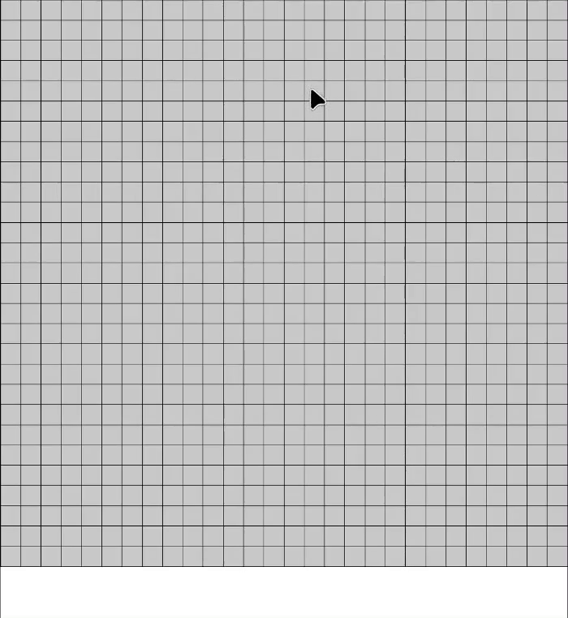

# MNIST MODEL
## A straightforward fully connected neural network used to predict digits based on handwritten digit images

The handwritten dataset looks like this:


Input images are 28 per 28 pixels in grayscale.

### Neural network architecture

This model is a straightforward fully connected feedforward neural network, with 2 hidden layers. The first hidden layer has 128 neurons, and the second hidden layer has 64 neurons. Both hidden layers use the ReLU activation function.

The final layer is a softmax layer, which is used to calculate the probability for each class, ranging from 0 to 9.

### Usage
```sh
python3 train.py --verbose=1
```

then, to visualize the model's predictions:

```sh
python3 visualizer.py
```

Visualizer allows you to draw a digit on the screen, and the model will predict which digit it is.
